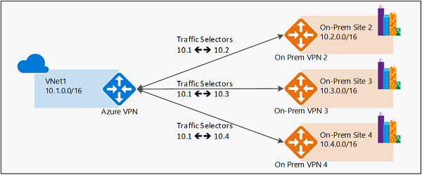
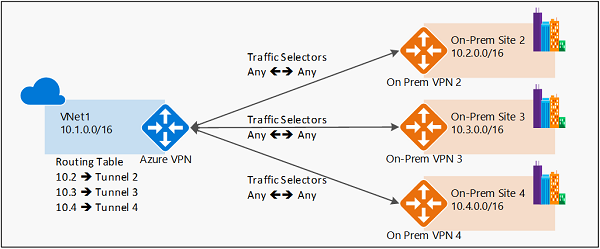

# Describe virtual networking, including the purpose of Azure virtual networks, Azure virtual subnets, peering, Azure DNS, Azure VPN Gateway, and ExpressRoute

## Virtual networking
Azure virtual networks and virtual subnets enable Azure resources, such as VMs, web apps, and databases, to communicate with each other, with users on the internet, and with your on-premises client computers. 

## Azure Virtual Networks
* Allows you to create multiple isolated virtual networks (vNets).
* An Azure Virtual Network is set up with a private IP address space, not accessible from the internet.
* The IP range can be divided into **subnets**, and allocated to a named subnet.
* Can communicate with Azure resources using
   * Virtual networks directly, to connect to resource types such as VMs, App Service Environments for Power Apps, Azure Kubernetes Service and Azure virtual machine scale sets.
   * Service endpoints, to connect to resource types such as Azure SQL databaser and storage accounts
* Can communicate with on-premise resources using
   * Point-to-site VPN: From a client computer (outside your organization) to your on-site or Azure resources via an **Azure VPN gateway**. Must be initiated by the client computer.
   * Site-to-site VPN: From on-premise device/ gateway to the Azure VPN gateway in a virtual network. This makes Azure resources appear as local resources.
   * Azure **ExpressRoute**: A dedicated private connection from you site to Azure, that doesn't travel over the internet.

## Azure subnets

## Peering
* Virtual networks can be linked using Peering.
* Two Virtual networks can be directly connected.
* Peering traffic uses the Microsoft backbone network.
* The virtual networks can be in different regions.

## Azure DNS
Used for name resolution.

## Azure VPN Gateway
* VPN = Virtual Private Network.
* A VPN uses an encrypted tunnel within another network, to connect two trusted networks using an untrusted network.
* The gateway is deployed in a subnet of the Virtual Network, and allows to connect on-premise datacenters, individual devices or other virtual networks to the Virtual Network.
* Only one gateway can be deployed to each virtual network.
* Authentication is done using a preshared key.
* The VPN Gateway must be set up specifying policy- or route- based VPN, determining which traffic needs encryption:
   * Policy based VPN gateway: A static set of IP-address prefixes decide the traffic that should be encrypted through each tunnel  
   
   * Route based VPN gateway: The traffic that should be ecrypted is routed through a virtual network interface or a tunnel interface using routing tables. IP routes then sends traffic through the correct tunnel, based on the destination IP address.  
     
   Route based VPN gateways are more recilient to network topology changes and should be used in the follwing scenarios:
      * Connections between virtual networks
      * Point-to-site connections
      * Multisite connections
      * Coexistence with an Azure ExpressRoute gateway
* Many high availability options for VPN Gateways are descibed here: https://learn.microsoft.com/en-us/training/modules/describe-azure-compute-networking-services/10-virtual-private-networks

## ExpressRoute
Azure ExpressRoute is a dedicated private connection from you site to Azure, that doesn't travel over the internet.

* Virtual Network Source: https://learn.microsoft.com/en-us/training/modules/describe-azure-compute-networking-services/8-virtual-network
* VPN Gateway source: https://learn.microsoft.com/en-us/training/modules/describe-azure-compute-networking-services/10-virtual-private-networks
* Route and policy based VPN gateway source: https://learn.microsoft.com/en-us/azure/vpn-gateway/vpn-gateway-connect-multiple-policybased-rm-ps

⬅️ [Return to Describe Azure architecture and services](README.md)

⬅️ [Return to Table of Contents](../README.md)